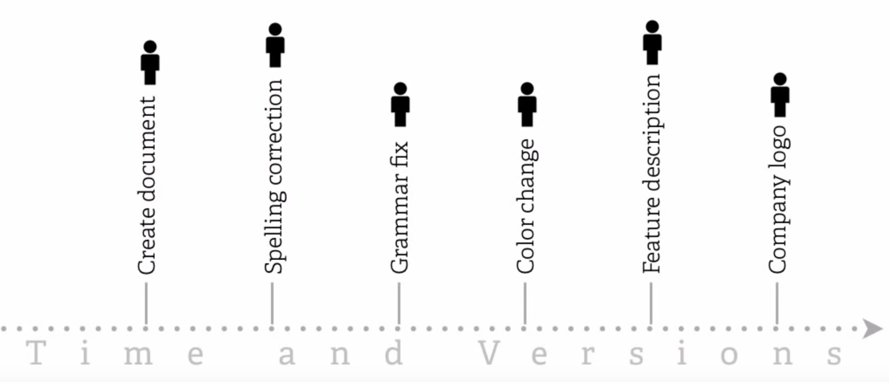

# Что такое Git

**Git (version control system)** — система контроля версий. Программа
позволяющая сохранять, изменять и отслеживать различные версии файлов проекта.
Работает по принципу чекпоинтов - контрольных точек, в которых сохраняется
состояние файлов.



## Установка Git

Заходим по ссылке
[https://git-scm.com/downloads](https://git-scm.com/downloads), скачиваем и
устанавливаем версию для своей операционной системы.

После завершения установки, открываем любой терминал. Пользователям Windows
рекомендуется использовать оболочку Git Bash, которая у них будет установлена
вместе с Git. Пользователи Linux и macOS могут использовать стандартный терминал
встроенный в их операционные системы.

Для проверки того, что Git был успешно установлен в систему, в терминале нужно
выполнить команду `git —version`. Если все в порядке, будет выведена
установленная версия Git.

## Настройка Git

Установка имени и электронной почты.

```shell
git config —global user.name “Ваше имя”
git config —global user.email “Ваша почта”
```

Параметры окончаний строк для пользователей Mac/Unix.

```shell
git config —global core.autocrlf input
git config —global core.safecrlf true
```

Для пользователей Windows.

```shell
git config —global core.autocrlf true
git config —global core.safecrlf true
```

Из-за флага `—global` настройки применяются глобально в системе, то есть для
всех будущих проектов. Поэтому настройка выполняется один раз. Посмотреть все
установленные настройки можно командой `git config —list`.

## Команда git init

Инициализирует git в текущей папке и создает локальный репозиторий. В текущей
папке создается подпапка `.git` содержащая все служебные файлы составляющие
основу репозитория. Любые файлы и папки вложенные в текущую смогут быть
подставлены под версионный контроль. Инициализация репозитория выполняется один
раз на проект.

## Команда git status

Проверяет в каком состоянии находятся файлы проекта и отображает эту информацию
в терминале. Каждый файл может находиться в одном из двух состояний: под
версионным контролем (отслеживаемые) и нет (неотслеживаемые).

**Неотслеживаемые файлы** — это любые файлы в рабочем каталоге, которые еще
никогда небыли зафиксированы и не входили в коммит.

**Отслеживаемые файлы** — это те файлы, которые были зафиксированы и входили в
коммит. Они могут быть неизменёнными, изменёнными или подготовленными к коммиту.

## Команда git add

Позволяет проиндексировать и зафиксировать изменения в файлах, тем самым добавив
файлы под версионный контроль.

```shell
# зафиксирует все произошедшие изменения
git add .

# зафиксирует изменения только в указанном файле
git add имя_файла

# зафиксирует изменения во всех файлах в указанной папке
git add имя_папки
```

## Команда git commit

Создает коммит, точку сохранения, запись в истории изменений. В коммит входят
все зафиксированные на текущий момент изменения отслеживаемых файлов.

```shell
git commit -m "Мой комментарий к коммиту"
```

Если необходимо изменить описание последнего коммита (например исправить
ошибку).

```shell
git commit —amend -m "Мой измененный комментарий к последнему коммиту"
```

## Игнорирование файлов

Практически всегда есть группа файлов, которые вы не только не хотите
автоматически добавлять в репозиторий, но и видеть в списках неотслеживаемых. К
таким файлам обычно относятся автоматически генерируемые файлы (различные логи,
результаты сборки и т.п.). В таком случае, в корне проекта, можно создать файл
`.gitignore` с перечислением шаблонов соответствующих таким файлам.

## GitHub

Переходим по ссылке [http://github.com/](http://github.com/), регистрируем
учетную запись с приличным ником на рабочую почту. В процессе регистрации
выбираем бесплатный план и пропускаем заполнение опросника.

## Создание SSH-ключа

В терминале выполняем команду `ssh -T -p 443 git@ssh.github.com`, если ответ
положительный - можно использовать SSH.

Переходим по ссылке
[connecting-to-github-with-ssh](https://help.github.com/en/github/authenticating-to-github/connecting-to-github-with-ssh)
и выполняем пошаговую инстукцию. SSH-ключ создается один раз для каждого
компьютера с которого будем работать с GitHub.

## Пара локальный/удаленный

Для создания GitHub-репозитория существуют два основных подхода.

Первый — это инициализация локального репозитория и его привязка к репозиторию
на GitHub при помощи команды.

```shell
git remote add origin ссылка_на_репозиторий
```

Второй — создание репозитория на сервере GitHub и его клонирование к себе на
компьютер при помощи команды.

```shell
git clone ссылка_на_репозиторий
```

## Команда git push

Позволяет отправить историю комиков локального репозитория на связанный с ним
удаленный репозиторий, например на GitHub.

Связывает локальный и удаленный репозиторий и отправляет историю коммитов на
удаленный репозиторий.

```shell
git push -u origin master
```

Отправляет историю коммитов на ранее привязанный удаленный репозиторий.

```shell
git push
```

## Дополнительные материалы

- [Основы Git](https://github.com/progit/progit/blob/master/ru/02-git-basics/01-chapter2.markdown)
- [Книга от Atlassian](https://www.atlassian.com/git/tutorials/what-is-version-control)
- [Git — инструмент для совместной работы](https://youtu.be/yDSs80lu3ak)
